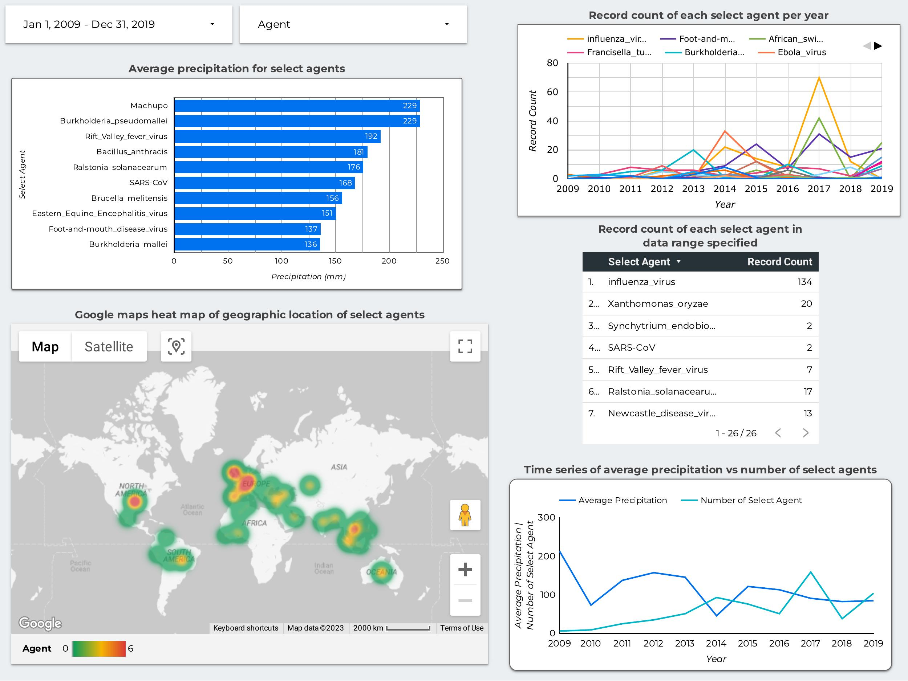

# Bio-agents and Precipitation Pipeline

This is a fun project to see if there are any correlations between select agents and precipiation. It is known that dramatic increases in precipitation can increase the liklihood of infectious diseases - [Infectious Disease, Weather, and Climate](https://academic.oup.com/cid/article/66/6/815/4773343). This project scrapes the select agent's webpage, pulls biosample data from SRA via NCBI's [EDirect](https://www.ncbi.nlm.nih.gov/books/NBK179288/) tool, parses the data via python, and loads it into BigQuery to be visualized by Looker Studio.

> Note: A large chunk of the data was removed during processing due to missing geographic locations OR the python tool `meteostat` did not have precipitation data for the geographic location on the specified date.

## Technologies Used

- Docker
- Google Cloud Platform 
    - Compute Instance
    - Google Cloud Storage
    - BigQuery
    - Looker Studio
- miniconda3
- Prefect
- Python
- Terraform


## Prerequisites

- Python 3

- GCP Service account and Google Storage Bucket. See [setting up google cloud platform](#google-cloud-platform-setup).

- Prefect - to set up prefect, create a conda environment and `pip install -U prefect`.

> Note: If scripts are ran without using the docker container located at `gregorysprenger/prefect-and-edirect:v1.0.0`, then dependency tools in `docker-requirements.txt` will need to be installed.

## Usage

1. Clone repository via `git clone https://github.com/gregorysprenger/bio-agents_and_precip.git`
2. Add GCP Service account credentials to `./credentials/creds.json`
3. Start Prefect orion server
```
prefect orion start
```

Open another terminal and set the prefect config, and start prefect's agent:
```
# Set config to specified URL to view GUI
prefect config set PREFECT_API_URL=http://127.0.0.1:4200/api

# Start prefect agent to listen for deployments
prefect agent start -q default
```

4. Create Docker block, GCP block, and deployments in Prefect:
```
python ./bin/deploy.py
```

5. Run first deployment to scrape webpage and fetch biosample information, and parse geographic location, add precipitation, and upload to Google Cloud Storage:
```
prefect deployment run fetch-and-transform/docker-flow1 -p "start=0" -p "end=65" -p "api_key=<ENTER NCBI API KEY HERE IF YOU HAVE ONE, IF NOT REMOVE PARAMETER>"
```

> A hard limit of 1 hour was set to fetch data for each query. SARS-CoV pulled the most amount of data. This step took 12.5 hours to run on a 16 CPU compute instance.

6. Run second deployment to pull data from Google Cloud Storage, concatenate, and upload to BigQuery to be visualized via Looker Studio.
```
prefect deployment run gcs-to-bq/docker-flow2 -p "start=0" -p "end=65"
```


7. Visualize data in Looker Studio (formerly Data Studio).

## Visualization



## Google Cloud Platform setup

1. Create Google Cloud Project
    - Create service account in IAM & Admin with name `agents-precip`
        - Add the following roles:
            - Viewer
            - BigQuery Adin
            - Storage Admin
            - Storage Object Admin
    - Go to manage keys, add and download key in JSON format
    - Rename key to `creds.json` and place in credentials directory

2. Enable the following API's:
    - [IAM](https://console.cloud.google.com/apis/library/iam.googleapis.com)
    - [IAM Credentials](https://console.cloud.google.com/apis/library/iamcredentials.googleapis.com)

3. Create Google Cloud Storage Bucket
    - Go to Cloud Storage and Buckets
    - Create a bucket with name `agents-precip`

> Note if names above are taken, choose a different name and update terraform scripts in the `terraform` directory and python scripts within the `bin` directory.
